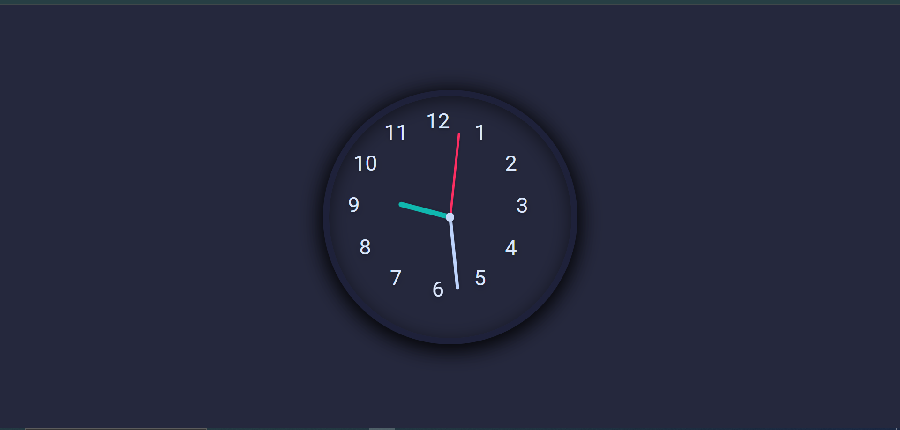

# ⏰ Animated Clock  

This is a simple **Animated Analog Clock** created using **HTML5, CSS3, and JavaScript**.  
The clock updates in real-time with smooth hand movements and a stylish responsive design.  

---

## 📸 Preview  
  

---

## 🚀 Features  
- Real-time working analog clock  
- Smooth animation for hour, minute, and second hands  
- Clean and modern UI design  
- Fully responsive layout  
- Built with **HTML, CSS & JavaScript**  

---

## 🛠️ Tech Stack  
- **HTML5**  
- **CSS3**  
- **JavaScript (Vanilla JS)**  

---

## 📂 Project Structure    
animated-clock/
│── index.html
│── clock.css
│── clock.js
│── image/
│ └── preview.png

---

## 🔗 Live Demo  
👉 [Click Here](https://attiq-ur-rehman4855.github.io/animated-clock/)  

---

## 👨‍💻 Author  
- Attiq Ur Rehman  
  [GitHub Profile](https://github.com/attiq-ur-rehman4855)  
