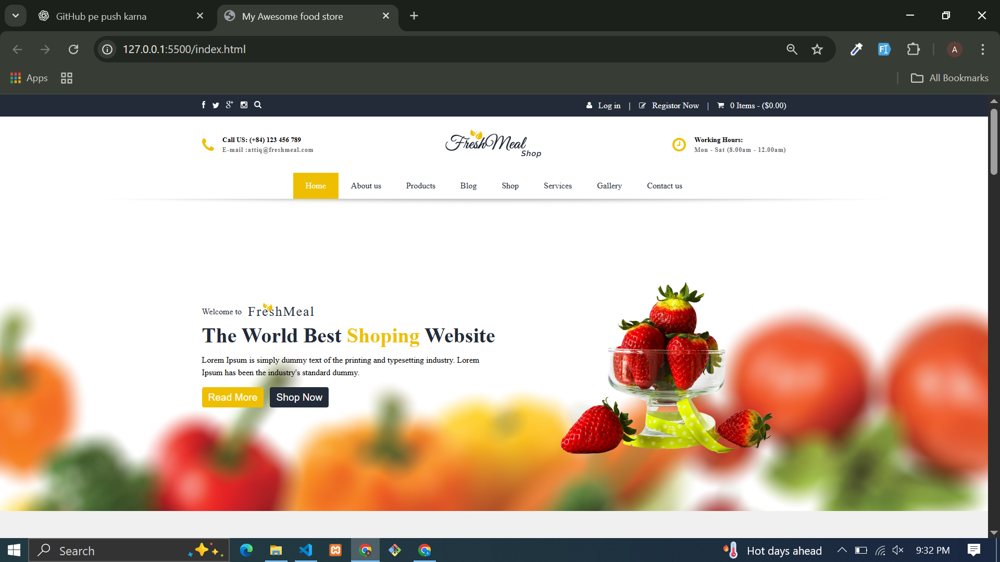

# 🍔 Food Store Website

A modern and responsive **Food Store Website** built using **HTML, CSS, and JavaScript**.  
It showcases food products, services, latest news, and includes features like:

## 🚀 Features
- Responsive design for all devices  
- Product slider using **Slick Carousel**  
- Newsletter subscription form  
- Contact section with Google Map integration  
- Clean and modern UI  

## 📸 Preview

## 🛠️ Tech Stack 
- HTML5  
- CSS3  
- JavaScript  
- Slick Carousel (for slider)

## 📂 Project Structure
food-store-website/
│── index.html
│── style.css
│── aap.js
│── assets/
    ├── icons/
    ├── images/
    ├── fonts/

## 🔗 Live Demo  
👉 [Click Here](https://attiq-ur-rehman4855.github.io/food-store-website/)  

## 👨‍💻 Author  
- Attiq Ur Rehman  
  [GitHub Profile](https://github.com/attiq-ur-rehman4855)  

---

