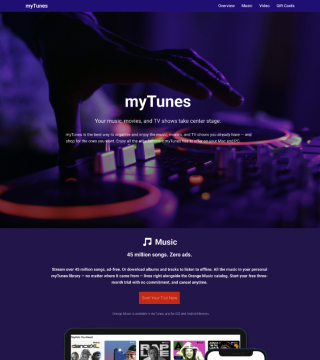

# 🎵 MyTunes Website  

This is a simple **MyTunes Website clone** created using only **HTML5 and CSS3**.  
The website showcases a modern UI with hero section, music, video, and gift card section.  

---

## 📸 Preview  
  

---

## 🚀 Features  
- Sticky navigation bar with smooth scroll  
- Hero section with call-to-action  
- Music streaming promo section  
- About music and movies showcase  
- Video background section  
- Gift card section with redeem option  
- Footer with multiple useful links  
- Fully responsive layout  
- Built with **HTML & CSS only**  

---

## 🛠️ Tech Stack  
- **HTML5**  
- **CSS3**  

---

## 📂 Project Structure  
mytunes-website/  
│── index.html  
│── style.css  
│── image/  
│   ├── project6.png  
│   ├── hero_image1.png  
│   ├── ipad-iphone.png  
│   ├── mac.png  
│   ├── video.png  
│   └── gift_card.png  

---

## 🔗 Live Demo  
👉 [Click Here](https://attiq-ur-rehman4855.github.io/mytunes-website/)  

---

## 👨‍💻 Author  
- Attiq Ur Rehman  
  [GitHub Profile](https://github.com/attiq-ur-rehman4855)  
